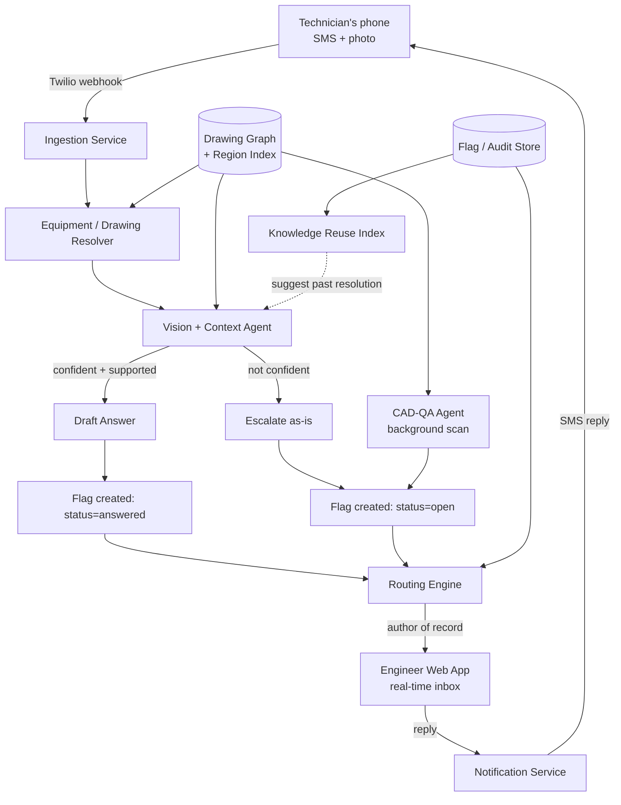

# Redline — System Architecture

**What this is:** an SMS-first system that lets a technician text a photo of physical hardware and a question, have an AI figure out which drawing and which point on that drawing it concerns, attempt a grounded answer if it's confident enough, and — if not — route the photo, note, and exact point to the engineer who actually authored that drawing. The engineer never creates flags. Their web app is a passive inbox: a drawing sits there until a technician's photo lands a pin on it.

---

## 0. Design principles (non-negotiable, everything below follows from these)

1. **Engineers are always recipients, never originators.** A flag on a drawing exists only because a technician's SMS produced it, or because the background CAD-QA agent (§6) found something. There is no "add flag" button in the engineer view. This mirrors how the job actually works today — nobody proactively annotates their own drawing with "this might be wrong."
2. **The technician's interface has zero learning curve.** Phone number = identity. No app, no login, no training. If it requires onboarding, it will not get used on a real floor.
3. **The AI never states an unsupported answer as fact.** Every AI-drafted answer carries a confidence score and is explicitly labeled tentative until the engineer confirms it. When the drawing context doesn't support a confident answer, the system says so and escalates — it does not guess.
4. **Every point on a drawing is addressable.** A "flag" is not just a comment; it is a comment bound to an (x, y) region on a specific drawing revision, traceable back to the photo that produced it.
5. **Nothing is silently overwritten.** Drawing revisions, flag history, and resolutions are append-only and fully auditable.

---

## 1. High-level architecture



Two independent paths create flags — a **reactive** one (technician SMS) and a **proactive** one (background CAD-QA agent scanning newly uploaded drawings). Both write into the same flag store and both surface in the same engineer inbox. Nothing else creates flags.

---

## 2. Multi-tenant / multi-profile model

This has to be multi-tenant from day one — every customer is a different company, often with multiple plants, and drawing IP must never cross tenant boundaries.

```
Organization (e.g. "ABB — Cary Plant")
 ├─ Sites (physical plants/lines within the org)
 │   └─ Work Cells / Lines (optional finer grouping)
 ├─ Users
 │   ├─ Technician   — identified by phone number, no login, scoped to one or more Sites
 │   ├─ Engineer      — web login (SSO via company IdP preferred), owns a Discipline (Electrical/Mechanical/Controls), sees only drawings they're author-of-record or backup-of-record for
 │   ├─ Reviewer/Lead — sees all flags across a Site, can reassign routing, no drawing ownership required
 │   └─ Admin         — manages org settings, PLM connector config, retention policy
 └─ Drawings (see §3), each owned by exactly one primary Engineer + optional backup(s)
```

**Technician identity:** phone number is the primary key. First inbound SMS from an unrecognized number triggers a one-time lightweight registration (reply with employee ID or badge scan), after which the number is permanently bound to that person within that org. No password, ever.

**Engineer identity:** standard web auth (SSO/SAML preferred for enterprise), scoped by org + discipline. Row-level security ensures an engineer at Plant A cannot see Plant B's drawings even within the same org, unless explicitly granted.

**Backup/coverage routing:** every drawing has a primary author and an optional backup chain (e.g., "if Marisol Rivera doesn't respond in 2 hours, or is marked out-of-office, route to the Electrical discipline lead"). This prevents a single person's PTO from stalling the floor.

---

## 3. Drawing ingestion & the region index

This is the piece that makes "map the photo to a point" possible at all — it has to happen once, up front, when a drawing enters the system, not at query time.

**Ingestion pipeline (per drawing):**

1. **Capture** — PDF, scanned TIFF, or native CAD export (DWG/DXF) is uploaded, or pulled automatically from the company's PLM/CAD system (SolidWorks PDM, Teamcenter, Windchill) via connector.
2. **Structured extraction** (vision-capable Claude call) — pulls title block fields: drawing number, revision, discipline, date, and critically, **author of record**. Cross-checked deterministically against the PLM metadata when available — PLM is the trusted source for authorship; the drawing's own extracted title block is a secondary check, not a substitute.
3. **Region decomposition** — a specialist pass segments the drawing into named, addressable regions (e.g., "Breaker cubicle CB-3," "Left upper mounting slot," "Terminal strip TB-1"). Each region gets: an id, a human-readable label, a bounding box (as % of drawing viewBox, resolution-independent), and a short description pulled from adjacent callouts/notes. This is the same "specialist decomposition over one generalist pass" principle from the verification research — a narrow "region-segmentation agent" outperforms asking one pass to do everything.
4. **Context assembly** — all extracted notes, GD&T callouts, and revision-delta text (what changed vs. the prior revision, and why) are stored as the drawing's context block. This is what grounds every downstream AI answer — the model is never allowed to answer from general knowledge, only from this block.
5. **Confidence floor** — if extraction confidence on any of the above falls below threshold, the drawing is marked "needs manual verification" and excluded from AI-answered flags (technician SMS about it still routes, just always as a direct escalation, never a tentative AI answer) until an engineer confirms the extracted regions once.

**Why regions instead of free-form coordinates:** free-form (x, y) from a vision model matching a *real photo* against a *technical drawing* is unreliable — different modality, different lighting, no shared visual vocabulary. Matching against a short list of *named, described* regions is a classification problem, which models are meaningfully better at than open-ended spatial localization. The region list is the actual trick that makes photo-to-point mapping work reliably.

---

## 4. What happens when a technician texts (step by step)

1. **Inbound SMS + MMS photo** hits the ingestion webhook (Twilio, or an on-prem SMS gateway for customers who won't allow a cloud carrier relay).
2. **Identity resolution** — phone number → known technician, known Site.
3. **Equipment resolution** — this is the step that answers "how does the system know which drawing?" without asking the technician to specify one. In priority order:
   - **QR/asset tag scan-to-text**: physical equipment on the floor carries a small QR sticker; texting a photo of it (or a code embedded in the MMS) auto-resolves the drawing. This is the strongest signal and worth pushing hard on as the primary UX — it also solves stale-revision detection for free, since the tag always points at the current revision.
   - **Active work order**: if the technician is currently checked into a work order/job in the MES, default to that job's drawing.
   - **Recent context**: if they texted about the same equipment in the last N minutes, assume continuation.
   - **Fallback — ask**: only if none of the above resolve, the system texts back a short numbered list ("1. Switchgear panel B  2. Motor mount 12C  3. Something else") — still zero-friction, a single reply digit.
4. **Vision + Context Agent call** — the photo, the technician's raw text, the resolved drawing's region list, and its context block are sent to the model in one call (`Sonnet`-class, vision-capable). It returns structured output: best-matching region id, confidence, one-line reasoning, and a diagnosis attempt that is explicitly instructed to say "not enough information" rather than fabricate when the context block doesn't support an answer.
5. **Confidence gate:**
   - **≥ threshold (e.g. 65) AND the drawing's context actually supports the diagnosis** → flag created with `status = answered`, tentative answer texted back immediately, pin drops on the drawing at the matched region.
   - **Below threshold, OR model itself flags insufficient context** → flag created with `status = open`, no answer is guessed, technician gets "sent to [Engineer] for a direct look."
6. **Flag write** — every flag is a row: drawing id, region id (+ raw x/y for display), photo reference, technician's text, AI's reasoning/confidence/diagnosis (if any), status, full timestamped thread, routed-to engineer id.
7. **Routing** — the flag's `routed_to` is simply the drawing's author of record (§3), with backup-chain logic (§2) applied if no engineer response within the SLA window.
8. **Engineer notification** — real-time push to the web app (WebSocket) if they're online; otherwise a digest or single push notification / email, configurable per engineer. The engineer is never asked to do anything but look and reply — they never manually create the flag that's waiting for them.
9. **Engineer reply** — typed once in the web app, delivered back to the technician as a plain SMS reply. The technician never knows or needs to know the system is more than a phone number they text.
10. **Resolution + audit** — engineer marks resolved (or the technician confirms it fixed their confusion via a simple SMS reply, which auto-resolves). The full thread — photo, AI draft, engineer's real answer, timestamps — is retained permanently for audit and reuse.

---

## 5. Knowledge reuse (stopping repeat questions before they're asked)

Before a new flag is even routed, run a lightweight retrieval pass against **resolved** flags on the same drawing (and optionally same region): embed the technician's note, compare against embeddings of past resolved flags' notes. If a strong match exists, surface the past resolution to the technician immediately over SMS *in addition to* still routing if they want a human anyway — never suppress the option to still reach the engineer, since the past answer might not actually fit their specific case.

This is the same mechanism as a symptom-based FAQ, but scoped tightly per drawing/region so it doesn't return irrelevant matches from unrelated equipment.

---

## 6. The proactive path: CAD-QA agent (the other way a flag appears)

This is separate from the technician-triggered path and answers "agent to scan and detect for CAD issues": when a new drawing (or revision) is ingested, a background pipeline reviews it *before* any technician ever sees it, using the verification-layer principles from the original design:

- **Deterministic checks first, zero model calls:** every wire endpoint references a real connector pin; every part number appears in the BOM; no orphaned references, no duplicate pin assignments; revision deltas are internally consistent. This alone catches a large share of drawing errors for free.
- **Critic/auditor agent:** a second agent, prompted differently from the extraction agent, reviews the already-structured data against the source image specifically looking for inconsistencies — not re-extracting from scratch. Different framing reduces shared blind spots.
- **Ensemble on spatial/symbolic reasoning only:** for GD&T callouts, cross-view references, and anything the deterministic pass flagged — run multiple independently-prompted passes and treat disagreement as a confidence signal. Skip this for tabular data (BOMs, wire lists), where single-pass extraction is already strong — ensembling everything is wasted spend.
- **Findings become flags, same schema as technician flags,** but tagged `source: cad_qa`, with `region_id` set directly instead of inferred from a photo, and no technician thread — just the AI's finding, routed to the drawing's author to confirm before the drawing ever reaches the floor.
- **Hard confidence floor:** if overall confidence on a drawing is below threshold, don't let it reach technicians as "ready" at all — hold it in an internal review queue.

---

## 7. Engineer web app (what the engineer actually sees)

- **Home = an inbox, not a canvas.** Drawings needing attention float to the top, sorted by oldest unanswered flag. This is deliberately not a "gallery of all your drawings" — it's "here's what needs you right now."
- **Drawing detail view:** the drawing rendered full-size with all pins overlaid (color-coded by status), exactly as in the demo built earlier — camera icon for SMS-originated pins, plain marker for CAD-QA findings.
- **Click a pin →** technician's actual photo, their raw text, AI's matched region + confidence + reasoning, AI's draft diagnosis if one exists, full thread, reply box, resolve button.
- **No "create flag" affordance anywhere.** This is the explicit design constraint from your note — engineers respond to what lands on their desk; they don't generate the work themselves. If an engineer notices something wrong on their own drawing unprompted, that's normal engineering review and happens in their CAD tool, not this app.
- **Coverage/backup settings:** engineer sets out-of-office status and backup contact directly in-app; this feeds the routing engine's SLA fallback.
- **History + analytics** (as built in the demo): full audit trail per drawing, and aggregate views — flags per drawing, per region, time-to-resolution — surfaced as a *design-quality signal* ("this drawing/revision generates unusually many questions, worth a second look next revision"), not as an individual performance scorecard. Keep the framing on the drawing and the revision, not the person, in the actual product copy — it keeps the tool useful without creating an incentive to hide questions.

---

## 8. Data model (core entities)

| Entity | Key fields |
|---|---|
| `Organization` | id, name, PLM connector config, retention policy |
| `Site` | id, org_id, name, address |
| `User` | id, org_id, role (technician/engineer/reviewer/admin), phone (technician) or email+SSO (engineer), discipline, backup_user_id, out_of_office |
| `Drawing` | id, site_id, drawing_number, revision, discipline, primary_author_id, backup_author_ids[], context_block (text), confidence_floor_status, source_file_ref |
| `Region` | id, drawing_id, label, description, bbox (x%, y%, w%, h%) |
| `Flag` | id, drawing_id, region_id, x, y, status (open/answered/resolved), source (sms/cad_qa), photo_ref, note, ai_confidence, ai_reasoning, ai_diagnosis, routed_to_user_id, created_at, resolved_at |
| `Message` | id, flag_id, from (technician/ai/engineer/system), text, photo_ref, created_at |
| `AuditEvent` | id, flag_id or drawing_id, actor, action, timestamp — append-only |

---

## 9. Tech stack

| Layer | Tool | Type |
|---|---|---|
| SMS/MMS ingestion | Twilio Programmable Messaging (or on-prem SMS gateway for regulated customers) | Paid (usage) |
| Ingestion service | FastAPI + Redis queue | Open source |
| Vision + context agent | Claude API (Sonnet, vision-capable) | Paid (usage) |
| CAD-QA verification pass | Claude API (Sonnet for extraction, Haiku for cheap secondary/critic pass) | Paid (usage, tiered) |
| Deterministic schema checks | Python + Pydantic | Open source |
| Region/consistency graph | NetworkX | Open source |
| Drawing preprocessing | OpenCV (deskew, glare correction) | Open source |
| Knowledge reuse / embeddings | sentence-transformers or Voyage AI + pgvector | Open source / paid |
| Engineer web app | React + TypeScript, WebSockets for live inbox updates | Open source |
| Backend / API | FastAPI, PostgreSQL, Redis | Open source |
| PLM/CAD connectors | Teamcenter/Windchill/SolidWorks PDM APIs (per-customer) | Integration effort, not a license cost |
| Notifications | Twilio (SMS out), SendGrid/SES (email fallback), WebSocket push (in-app) | Open source / cheap |
| Auth | SSO/SAML (engineers), phone-number identity (technicians) | Open source (e.g. WorkOS/Auth0) |
| Hosting | On-prem or single-tenant cloud VPC per customer — drawings are sensitive IP, this is a sales requirement, not a nice-to-have | Varies |
| Audit logging | Append-only Postgres table + object storage (S3-compatible) for photos/drawings, immutable retention policy | Open source |

---

## 10. Security & trust — the parts that actually determine if this sells

- **Tenant isolation is structural, not just a WHERE clause** — separate schemas or databases per customer for anything touching drawing content, given how sensitive this IP is treated (see the ABB IP-assignment caveat from earlier).
- **On-prem/VPC option from day one.** Every comparable product in this space (Operon, Vela) leads with this because procurement/IT blocks the deal otherwise.
- **Photo retention policy must be explicit and configurable** — technician photos may capture more of the floor than intended; default to shortest reasonable retention, customer-configurable, with clear deletion guarantees.
- **Every AI output that ever reaches an engineer is labeled as such and never silently merged with human-authored content** — this is what keeps the audit trail legally and operationally meaningful.

---

## 11. Build phasing

| Phase | Scope | Notes |
|---|---|---|
| 1 — Core loop | Drawing ingestion + region decomposition, technician SMS → AI region match → engineer web inbox → reply back | This is the whole demo already built; the real remaining work is ingestion (§3) and SMS (§4 steps 1–3) |
| 2 — Routing depth | Backup/coverage chains, SLA escalation, multi-site/multi-tenant auth | |
| 3 — CAD-QA agent | Background proactive scanning (§6) | Independent of Phase 1, can be built in parallel |
| 4 — Knowledge reuse | Embedding-based similar-flag suggestions at both SMS-time and engineer-review-time | |
| 5 — PLM integration | Real connector to whatever CAD/PLM system the customer runs, replacing manually-uploaded drawings | This is the actual sales-blocking dependency — a pilot customer needs this before real drawings can flow in |

